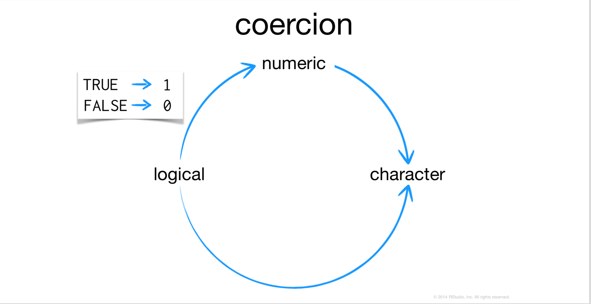
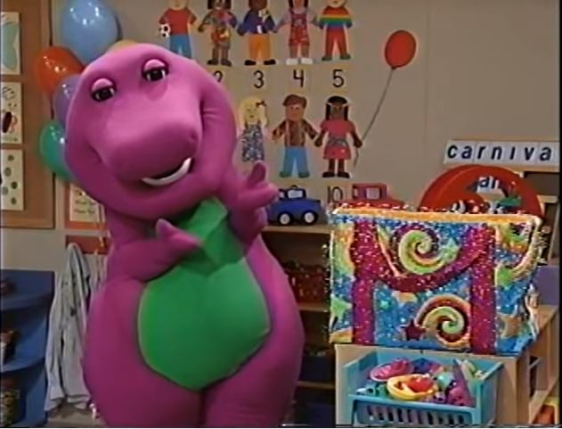

# <a></a>
   . <br/>

#The R Language: Part 02

## R Objetcs

### Variable Assignment
A basic concept in (statistical) programming is called a **variable**. 

A variable allows you to store a value (e.g. 4) or an object (e.g. a function description) in R. You can then later use this variable's name to easily access the value or the object that is stored within this variable. 

Save information as an R objetc with the *greater than* sign followed by *a minus*, e.g. an arrow: `<-`
```{r}
#name of new objetc         assignment operator, "gets"         information to store in the objetc
foo                                 <-                            42
```

### Common R Workflow
Save output of one function as an R objetc to use in a second function
```{r}
foo <- round(3.1415) + 1
foo
```

```{r}
factorial(foo)
```

## Remove objetcs from environment
You can remove an objetc with `rm`
```{r}
fac_foo<-factorial(foo)
fac_foo
```

```{r}
rm(foo)
rm(fac_foo)
```

### To consider...

- Object names cannot beggin with numbers. Wise to avoid names already in use.

```{r}
mean<-mean(rnorm(100))
mean
?mean
```
```{r}
rm(mean)
pi
pi<-1
pi
rm(pi)
pi
```

- R will treat the lowercase and capital letters as different.


## Data Structures

You can save more than a single number in an objetc by creating a *vector*, *matrix*, or *array*.

```{r}
WorldPhones
class(WorldPhones)
```


### Vectors

- Combine multiple elements into one dimensional array.

- Create with the `c` function.
```{r}
vec<-c(1,2,3,10,100)
vec
```

### Matrices

- Combine multiple elements into a two dimensional array.

- Create with the `matrix` function.
```{r}
            #vector of elements to go in the matrix     number of rows for matrix

mat<-matrix(data = c(1,2,3,4,5,6),                      nrow = 2)
mat
```

```{r}
            #vector of elements to go in the matrix     number of rows for matrix

mat<-matrix(data = c(1,2,3,4,5,6),                      nrow = 3)
mat
```


```{r}
            #vector of elements to go in the matrix     number of cols for matrix
#rbind(c(1,2,3,4,5,6),c(1,2,3,4,5,6)*2)
mat<-matrix(c(1,2,3,4,5,6),ncol=2)
mat
```

### Math: element- wise
```{r}
vec2<-vec
vec2<-vec + 4
vec; vec2
```

```{r}
vec * 4 ; vec2 * 4
```

```{r}
vec * vec ; vec2 * vec2; c(23,vec) * c(vec2,2);vec;vec2
```

### Matrix multiplication

**inner**
```{r}
mat<-matrix(c(1,2,3,4,5,6,7,8,9),ncol=3)
vec; vec %*% vec; mat;mat %*% mat
```

**outer**
```{r}

mat<-matrix(c(1,2,3,4,5,6),ncol=2)
vec; vec %o% vec; mat; mat %o% mat; mat %o% vec
```

**transpose**
```{r}
mat
```

```{r}
t(mat)
```

##Data types
R can recognize different types of data.

We'll look at four basic types:

- numbers
- character strings (text)
- logical
- factor


### numeric
- Any number, no quotes. 
- Appropiate for math.

```{r}
12+4
```

```{r}
3000000
```

```{r}
class(0.000001)
```

### character

- Any symbols surronded by quotes.
- Appropiate for words, variable names, messages, any text.

```{r}
print("hello")
print('hello')

 #print("hello') #ESTO ESTÁ MAL
```

```{r}
class("hello")
```


```{r}
"12+4"
```

```{r}
class("12+4")
```

```{r}
#"hello" + "world"
```

```{r}
nchar("hello")
```

```{r}
paste("hello","world",sep=",");paste("hello","world",sep=" 2342eafdsghsIJGBJmdxfghvb ")
```


```{r}
paste("hello","world",sep=",");paste("como","estas",sep="_");

paste(paste("hello","world",sep=","),paste("como","estas",sep="_"),2,sep="::"); paste(paste("hello","world",sep=","),paste("como","estas",sep="_"),"2",sep="::"); paste("hola","sin","espacios",sep="");paste0("hola","sin","espacios")
```

### To consider...
**wich are numbers?**

```{r}
1; "1"; "one"
```
```{r}
c(1, "1","one")
```
### logical
`TRUE` or `FALSE`
- R's form of binary data. 
- Useful for logical tests.
- And Very Useful when whe want to filter datasets...

```{r}
3<4
x <- c(1, 2, 3, 4, 5)
x
x > 3
x >= 3
x < 3
x <= 3
x == 3
x != 3
x = 3

c(3,4,5,6) %in% c(2, 3, 4) 

```

```{r}
titanic2<-read.csv("data/titanic2.csv",header = T)
titanic2
```

```{r}
library(dplyr)
titanic2%>%
  filter(age=="adult")
```

```{r}
titanic2%>%
  filter(class=="1st")
```

```{r}
titanic2%>%
  filter(male<mean(male))
```

```{r}
titanic2%>%
  filter(female>=mean(female))
```
```{r}
unique(titanic2$class)
unique(titanic2$age)
```
```{r}
titanic2%>%
  filter(fate!="survived" & 
           as.numeric(class)>=3 & 
           as.numeric(age)<2)
```

```{r}
titanic2%>%
  filter(fate=="survived" & 
           as.numeric(class)>=3 & 
           as.numeric(age)<2)
```

```{r}
titanic2%>%
  filter(fate=="survived" & 
           class%in%c("1st","3rd"))
```

```{r}
titanic2%>%
  filter(fate!="survived" & 
           class%in%c("1st","3rd"))
```


```{r}
class(TRUE)
```

```{r}
class(T) ; class(F)
```

```{r}
class(3<4)
```

## factor
R's form of categorical data. Saved as an integer with a set of labels (e.g. levels)
```{r}
fac<-factor(c("a","b","c"))
fac
```
```{r}
class(fac)
```
**One proof that *factor* makes sense**
```{r}
titanic2
```

```{r}
library(ggplot2)
gg<-ggplot(titanic2,aes(x=class,y=age))
gg + geom_point(aes(size=male))
```
```{r}
gg + geom_point(aes(color=fate))
```

```{r}
gg01<-gg + geom_point(aes(color=fate,size=male+female))
gg01
```
```{r,fig.height=6,fig.width=10}
library(plotly)
ggplotly(gg01)
```


### To consider...

- Remember that if you want to assign a number or an object to a variable in R, you can make use of the assignment operator `<-`. Alternatively, you can use `=`, but `<-` is widely preferred in the R community.

```{r, echo=TRUE}
# Assign a value to the variables my_apples and my_oranges
my_apples  <- 5
my_oranges <- 6

# Add these two variables together
my_apples + my_oranges

# Create the variable my_fruit
my_fruit <- my_apples + my_oranges
```

## watch out!
Be careful with the operations between different types/classes of objects
```{r, echo=TRUE}
# Assign a value to the variable my_apples
my_apples <- 5 

# Fix the assignment of my_oranges
my_oranges <- "six" 
```

```{r, echo=TRUE}
# Create the variable my_fruit and print it out
# my_fruit <- my_apples + my_oranges
```

```{r, echo=TRUE}
class(my_oranges)
```
```{r, echo=TRUE}
class(my_oranges)
```
So, in general, it's a good idea to check that the objetcs that are opperating between each other, are of the same class/type or we have to be conscients that sometimes, if the types are not equals but they are "almost operables", *R* will change at least one of them to a type that make both be "totaly operables". 

There could be some warnings about this... it could be a good idea to knoe a little more about the **data types** that will be jumping in at our work.

## Saving differents types in one single object...

*On a Vector...*
```{r}
vec<-c(1,"R","TRUE")
```

```{r}
class(vec)
```

```{r}
vec
```

*Sure a Matrix will do it...*
```{r}
matriz_de_Camilo<-matrix(cbind(c(1,2,3),
                         c("R","S","T"),
                         c(TRUE,FALSE,TRUE)),ncol=3)
```

```{r}
class(matriz_de_Camilo)
```

```{r}
matriz_de_Camilo
```

```{r}
for(row_tmp in 1:nrow(matriz_de_Camilo)){
  print(class(matriz_de_Camilo[row_tmp,]))
}
  
```

```{r}
for(col_tmp in 1:ncol(matriz_de_Camilo)){
  print(class(matriz_de_Camilo[,col_tmp]))
}
  
```

```{r}
matriz_de_Camilo
```

*What the ... is R doing?!*



**So, isn't there any way we I can  do it?**


**Really? ;( **


**There is a way... Thank God for the `data frames`...**


**And for the `lists`...**


## Data frames
```{r}
df<-data.frame(c(1,2,3),
               c("R","S","T"),
               c(TRUE,FALSE,TRUE))
df
```

```{r}
df_de_Camilo<-as.data.frame(matriz_de_Camilo)
df_de_Camilo
```
```{r}
as.data.frame(matriz_de_Camilo,stringsAsFactors = F)
```

**When we read a *.csv* file and store it on a object, that will be a `data.frame` class**

```{r}
titanic2 ## remember how we got this object: read.csv("data/titanic2.csv",header = T)
class(titanic2)
```

**And now, just because it's worthy...**


- There are some types of objects very similar to the `data frames` but that are not exactly one of those

- They came from the package `dplyr` *(one of my favorites)* and its class is called `tibble` *(nickname: **`data_frame`**)* instead of **`data.frame`**

- Example:
```{r}
library(nycflights13)
flights
```

```{r}
class(flights)
```

- Print on console:

  - `titanic2`
  &, afterwards
  - `flights`
  
- Do you see any difference?

## List




```{r}
nlst<-list(one=1,two=2,many=c(1,2,3))
nlst
```
```{r}
nlst<-list("Eduardo"=df_de_Camilo,"Camilo"=matriz_de_Camilo,"Carlos"=c(T,FALSE,TRUE,F))
#Print directly on console
nlst
```
```{r}
nlst$Eduardo
```

```{r}
#Print directly on console
nlst[1]
```

```{r}
#Print directly on console
nlst[[1]]
```

```{r}
nlst02<-list("Eduardo"=df_de_Camilo,"Camilo"=matriz_de_Camilo,"Carlos"=c(T,FALSE,TRUE,F),"unalistadentrodeunalista"=nlst)
#Print directly on console
nlst02
```

```{r}

```

