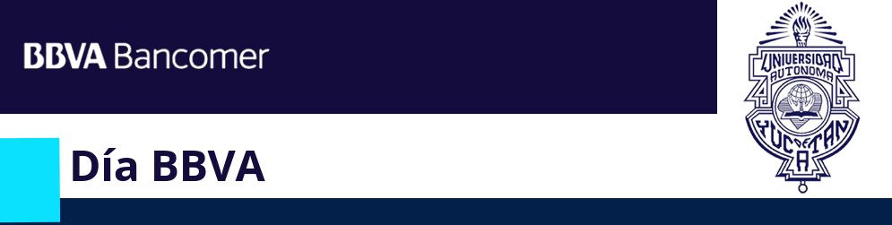

Workshop BBVA UADY
===============================================

# <a></a>

<br/> 

# <a></a>

<br/>  

|What We'll Do|
|-------------|

Sharing a little bit of the tools we use at the office as part of our data science process helping us mainly by our awesome friend **R** and the amazing pal **Git**

# First steps

## Bring the tools
- [Download R](https://cran.itam.mx/)
- [Download RStudio](https://www.rstudio.com/products/rstudio/download/#download)

## Bring the clone
- [Clone this repository](git@github.com:adfmb/workshop_BBVA_UADY.git):

  `git clone --recurse-submodules https://github.com/adfmb/workshop_BBVA_UADY.git`
  
  - Or Fork it and then clone it from your user 
  
  `git clone --recurse-submodules https://github.com/<youruser>/workshop_BBVA_UADY.git`
- Go to the repository's folder on your computer
 `cd workshop_BBVA_UADY`
- Standing at *workshop_BBVA_UADY/*, create a folder with your username where you will be saving your progress
 `mkdir <youruser>`
  

## Add `remote`
Here we'll "conect" or "link" our *fork's local clone* (our laptop) to the repo *adfmb/workshop_BBVA_UADY*.

- Go to the repository's folder on your computer
 `cd workshop_BBVA_UADY`
- Check with the `git remote -v`
```
➜ git remote -v
origin  https://github.com/<youruser>/workshop_BBVA_UADY.git (fetch)
origin  https://github.com/<youruser>/workshop_BBVA_UADY.git (push)
```
- Add the **repo-class** from url for the future *pulls*:
  
  `git remote add repo-class https://github.com/adfmb/workshop_BBVA_UADY.git`
- Confirm by writing again the `git remote -v`
```
➜ git remote -v
origin  https://github.com/<youruser>/workshop_BBVA_UADY.git (fetch)
origin  https://github.com/<youruser>/workshop_BBVA_UADY.git (push)
repo-class     https://github.com/adfmb/workshop_BBVA_UADY.git (fetch)
repo-class      https://github.com/adfmb/workshop_BBVA_UADY.git (push)
```

# Further steps
## For update new local & remote info (pull & push)
- When we generate **new info and files at our fork's local clone** (our laptop) and, with it ,we want to update our *fork* (on the web `<youruser>/workshop_BBVA_UADY`), the way is by: 
  
  `git push origin master`

- If we want that our changes on our *fork* (on the web `<youruser>/workshop_BBVA_UADY`) be reflected on the *repo-class* (on the web `adfmb/workshop_BBVA_UADY`), as [**samorogu**](https://github.com/samorogu) taught us at his [**freaking awesome Git's course**](https://github.com/mexmet/talleres-SME/blob/master/git/00_Intro_git.Rmd), we'll need to do a `pull-request` from the **browser** and wait for the authorized merge.

- When **new info is available on the repo-class** (on the web `adfmb/workshop_BBVA_UADY`), we'll bring it to our *fork's local clone* (our laptop) by:

  `git pull repo-class master`


## References

**Thanks so much to this incredible smart guys for all their wisdom which I've been collected for this project:**

- [Intro *by rstudio*](https://github.com/rstudio/Intro)

- [courses-intro-to-r *by datacamp*](https://github.com/datacamp/courses-intro-to-r)

- [dplyr](https://github.com/tidyverse/dplyr/)

- [IntroToDataScience *by EasyD*](https://github.com/EasyD/IntroToDataScience)

- [git tour at **tutoriales/** *by ITAM-DS* ](https://github.com/ITAM-DS/tutoriales/blob/master/2-git-tour.Rmd)

- [Intro git at **talleres-SME/** *by samorogu*](https://github.com/mexmet/talleres-SME/blob/master/git/00_Intro_git.Rmd)
